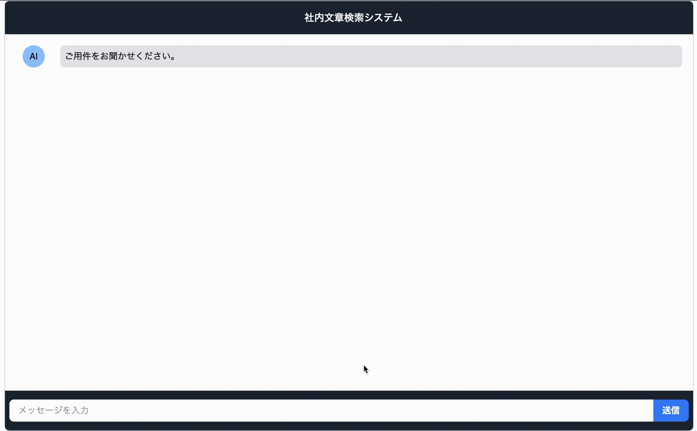
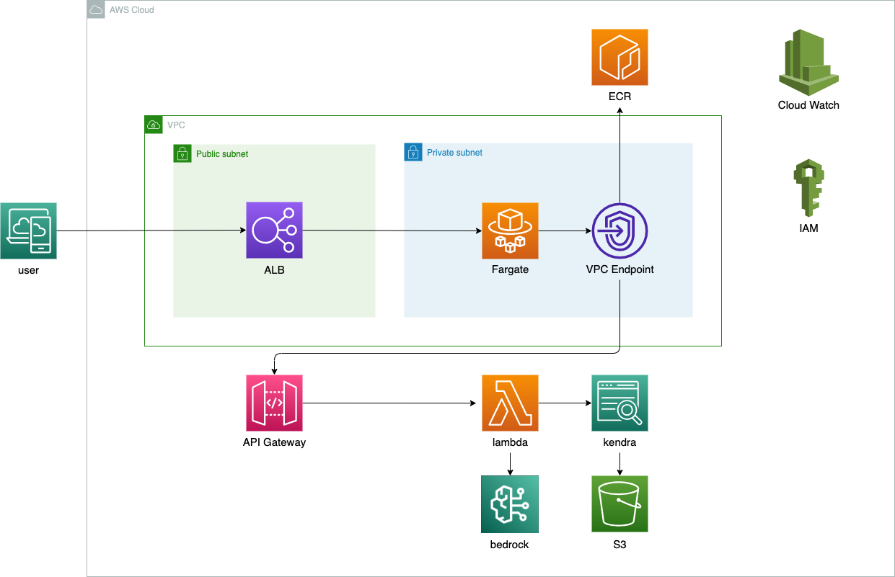
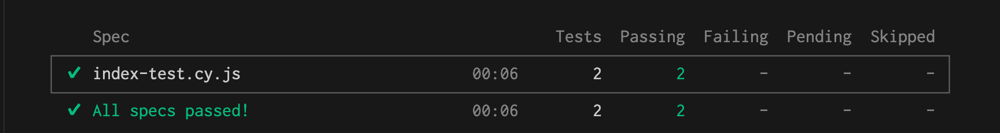

# practice_bedrock

<p align="center">
  
</p>


[](https://www.python.org/)

[](https://docs.docker.com/compose/)


# インフラ構成

<p align="center">
  
</p>


# 起動とデプロイ方法
1. 以下のコードを実行してインフラを構築とwebserverのデプロイをします。
```
bin/terraform_apply
```

2. AWSマネジメントコンソールにアクセスとS3との同期
    1. AWS マネジメントコンソールで Amazon kendraサービスに移動します。
    2. indexページのデータソースセクションで、「Sync now」ボタンをクリックし、S3バケット内のすべてのファイルがインデックスに登録します。

3. ECSからDNSをコピー
    1. AWS マネジメントコンソールで Amazon Elastic Container Serviceに移動します。
    2. ECS ダッシュボードで、クラスターのリストから対象のクラスターを選択します。
    3. クラスターの詳細画面が表示されたら、左側のナビゲーションメニューから「タスク」を選択します。
    4. タスクのリストから、対象のタスクを選択します。
    5. タスクの詳細画面が表示されたら、画面内の「ネットワーク」セクションをスクロールして、DNS 名を見つけます。
    6. DNS 名の横にあるコピー（Copy）アイコンをクリックして、DNS をクリップボードにコピーします。

4. URLにアクセス
    1. ブラウザを開き、先ほどコピーしたURLにアクセスします。

# 停止
以下のコードを実行すると停止できます。
```
bin/terraform_destroy
```

# ディレクトリ構成

```
.
├── README.md
├── apserver
├── bin
├── compose.yaml
├── document
│   ├── 社則.txt
│   ├── 休暇規程.txt
│   ├── 手当規程.txt
│   └── 賃金規程.txt
├── infra
├── source
└── webserver
    ├── Dockerfile
    └── app
        └── app
            ├── api
            │   └── route.ts
            ├── components
            │   ├── ai_msg.tsx
            │   ├── form.tsx
            │   └── user_msg.tsx
            ├── favicon.ico
            ├── globals.css
            ├── layout.tsx
            ├── page.tsx
            └── types
                ├── modlues
                │   └── React.d.ts
                └── typing
                    └── msg.d.ts
```

+ README.md: プロジェクトに関する説明や使用法を記述したテキストファイルです。
+ apserver: api gatewayのローカル擬似サーバーです。
+ bin: 実行可能ファイルやスクリプトが格納されるディレクトリです。
+ compose.yaml: Docker Compose の設定ファイルです。
+ document: 社内文章(例文)のドキュメントが格納されているディレクトリです。
+ infra: インフラストラクチャの関連ファイルが格納されているディレクトリです。
+ source: README.mdで使用するpngやgifが格納されているディレクトリです。
+ webserver: ウェブサーバーの関連ファイルが格納されているディレクトリです。


# テスト項目
+ ルートエンドポイントの正常処理検証テスト
+ 質問送信による正常処理テスト

# テスト結果

<p align="center">
  
</p>


